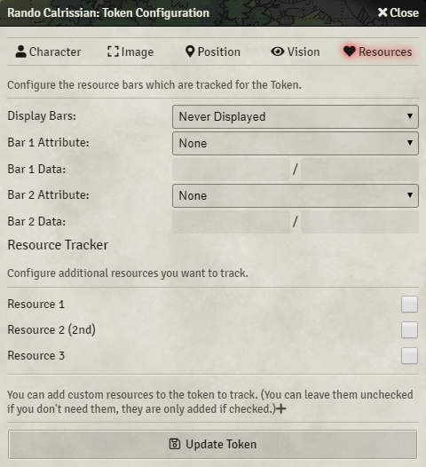
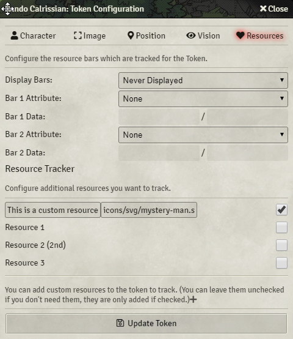
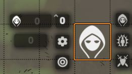

# vtt-resource-tracker
This module allows you to track additional resources from the actor and also add custom resources on every token.
The custom resources are not persistent (they are cleared on every refresh), to have a resource stay after a refresh, it needs to be assigned to a actor resource.

Existing resources can be selected in the token config

New resources (non-persistent) can be added as well

Tracked resources can be modified in the token hud

## Compatibility
[5eSheet-resourcesPlus](https://github.com/ardittristan/5eSheet-resourcesPlus)

You can also use resourcesPlus to add a additional resource and then remove the module again, the resource will stay on the actor.
