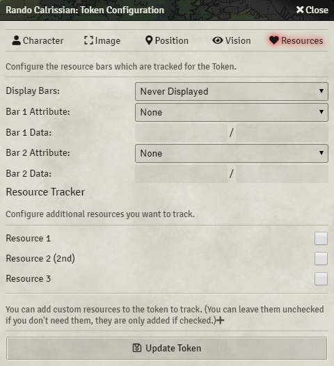
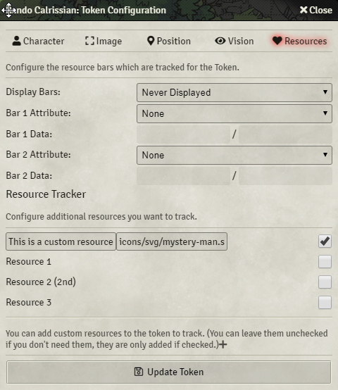
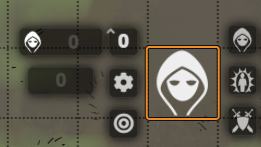
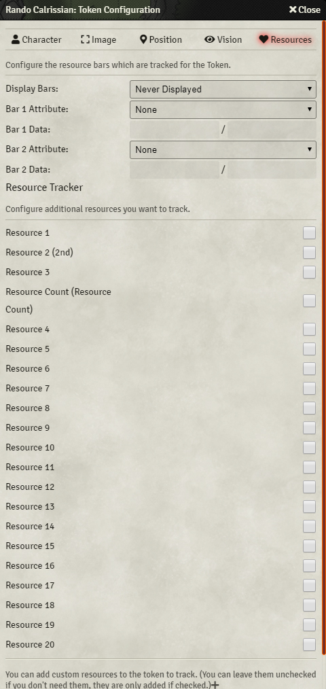
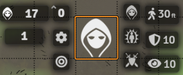

# vtt-resource-tracker
This module allows you to track additional resources from the actor and also add custom resources on every token.
The value of a custom resources is not persistent (it is cleared on every refresh), to have a resource value stay after a refresh, it needs to be assigned to a resource of an actor.

It can be used to track stealth roles of PCs or NPCs to quickly store the value on the Token HUD.

Existing resources can be selected in the token config

New resources (non-persistent) can be added as well

Tracked resources can be modified in the token hud

## Compatibility
[5e-Sheet Resources Plus](https://github.com/ardittristan/5eSheet-resourcesPlus)
You can use resourcesPlus to add a additional resource, all of them can be tracked, even if you remove the module again, resources you have added with it will stay.

[FVTT - Token Info Icons](https://github.com/jopeek/fvtt-token-info-icons)
You can use both, but you should select different sides for both modules.

