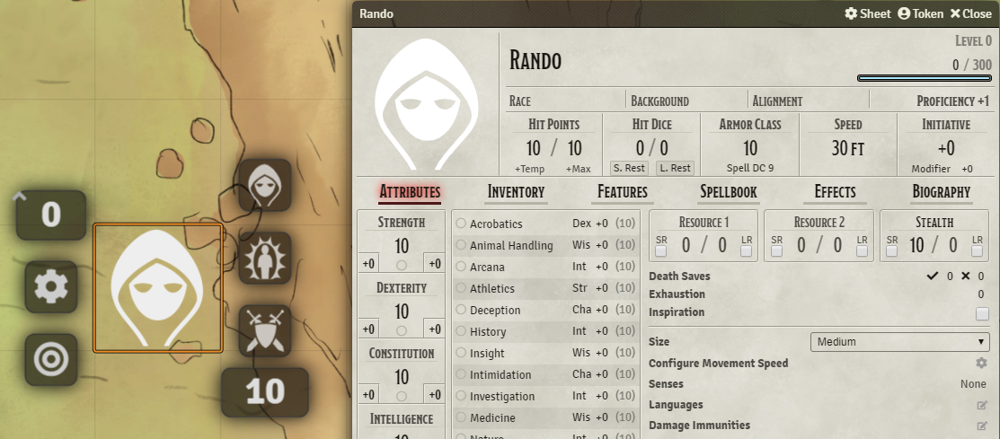

# vtt-resource-tracker
This module allows you to track additional resources in the token hud

## Compatibility
[5eSheet-resourcesPlus](https://github.com/ardittristan/5eSheet-resourcesPlus)

You can also use resourcesPlus to add a additional resource and then remove the module again, the resource will stay on the actor.
